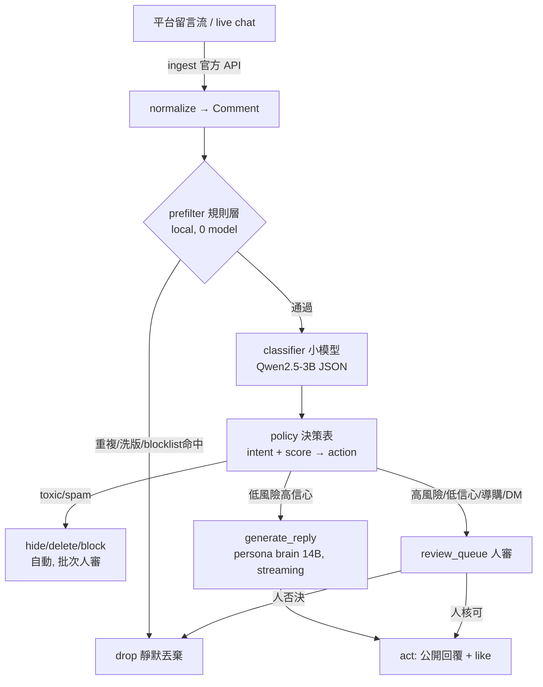

> **Status（2026-07-13）**：draft / 探索設計。本文件把 KOL 從「會聊天」擴充到「會**讀觀眾留言 →
> 有選擇地行動**」——只回應/互動值得回應的留言（濾掉 spam、toxic、off-topic；優先高購買意圖/提問/
> 高互動留言），全程 **local、省 API**。
>
> 定位：本文件是 `03-phase1-detailed-design.md` 的**水平擴充模組**，不是重寫。它**重用** 03 已經設計好的
> persona brain（§2 的 `build_system_prompt`）、backend（§4 的 Ollama OpenAI-compatible）、streaming
> 契約（§3.3 的 `TokenChunk`）。它也對應 `references/AI_Livestream_Report.md` 點名、而 02/03 尚未落地的
> 「留言辨識 → 行為路由（Action Routing）」那一層（該導讀第 50–61、100–102 行）。
>
> 範圍界線：只處理**文字留言/直播 chat 的讀取與回應決策**。語音播報、對嘴、虛擬形象渲染、公開直播推流
> 屬 Phase 2/3（見 04–08），本文件只確保設計不擋到它們。

# 11. Comment Read-and-Act Loop — 讀留言 → 選擇性行動

## 0. 這份文件要解決什麼

03 設計的是「一對一、使用者主動輸入 → 角色回應」。本文件解決的是**反過來、對多、由外部事件驅動**的
情境：平台上有一大批觀眾留言湧入，KOL 角色要自己決定「哪些值得理、理的話用什麼動作」。核心新增三件事：

1. **Ingest**：從平台合法取得留言流（IG/YouTube 官方 API 為主；TikTok 有 ToS 地雷，見 §5）。
2. **Triage（分流）**：用**小模型 local** 過濾 spam/toxicity、判斷意圖、打優先分數——**不是**每則留言都丟
   給 14B persona brain（那會慢又燒資源），而是先用便宜的層層過濾。
3. **Act（行動）+ Human-in-the-loop**：把「意圖+分數」映射到具體動作（公開回覆／按讚／置頂／DM／做
   後續內容／導購），並明確標出**哪些動作必須人審**才放行。

設計原則沿用 03：**確定性優先、單一模型依賴盡量不增加、streaming 不能斷、persona 是唯一真相來源只讀不改**。

---

## 1. 在整體架構的位置

```
                          kols/{id}/  (唯一真相來源，只讀)
                                │  build_system_prompt() [03 §2]
                                ▼
        ┌───────────────────────────────────────────────────────────┐
        │  companion/src/companion/                                   │
        │                                                             │
        │  ┌──────────────┐   generate_reply()   ┌─────────────────┐  │
        │  │ interaction/ │◄─────────────────────│ orchestrator/   │  │
        │  │ (本文件 NEW) │   TokenChunk stream   │ persona brain   │  │
        │  └──────┬───────┘  ────────────────────►│ + backend [03]  │  │
        │         │                               └─────────────────┘  │
        └─────────┼───────────────────────────────────────────────────┘
                  │ 官方平台 API (讀留言 / 回覆 / 隱藏 / 按讚)
                  ▼
        IG Graph API · YouTube Live Streaming API · (TikTok: 見 §5 風險)
```

新增目錄（掛在 03 §1 的樹上，與 `voice/`、`avatar/` 同級是**新的事件來源**，不是新的 persona 邏輯）：

```
companion/src/companion/interaction/          # 本文件
├── ingest/
│   ├── base.py            # RawComment/Comment schema + Adapter 介面 (§3.1)
│   ├── instagram.py       # IG Graph API：webhook + /replies + hide/like
│   ├── youtube.py         # liveChatMessages.streamList (server-push, §5)
│   └── tiktok.py          # 預留 stub；預設停用，理由見 §5 風險
├── triage/
│   ├── prefilter.py       # 規則層：dedup / rate-limit / blocklist / regex (§3.2)
│   └── classifier.py      # 小模型層：JSON 分類 + 優先分數 (§3.3)
├── policy/
│   └── decision.py        # comment type → 分數 → action 決策表引擎 (§4)
├── act/
│   ├── executors.py       # 各平台的 reply/like/hide/pin 實作
│   └── review_queue.py    # human-in-the-loop 佇列 (§4.3)
└── loop.py                # ingest→prefilter→classify→decide→act 主迴圈 (§6)
```

---

## 2. 資料流（一則留言的一生）



要點：**只有通過 prefilter + 分類為低風險 + 決策表允許自動** 的留言，才會真的花到 14B persona brain 的
算力去生成回覆。絕大多數留言（讚美刷屏、emoji、spam）在前兩層就被便宜地處理掉。

---

## 3. 各層規格

### 3.1 Comment schema（正規化後，平台無關）

```json
{
  "comment_id": "ig_17901...",
  "platform": "instagram | youtube_live | tiktok",
  "media_id": "本則留言所屬的貼文/直播 id（必須是本 KOL 自己的內容，§5）",
  "is_live": false,
  "author_id": "平台 user id（雜湊後儲存，隱私）",
  "author_handle": "@someone",
  "text": "這件洋裝哪裡買？多少錢～",
  "lang": null,               // 由 classifier 回填
  "author_follows": null,     // 平台若提供
  "likes": 0,
  "ts": "2026-07-13T10:00:00+08:00"
}
```

### 3.2 Prefilter 規則層（零模型、確定性、擋掉大宗）

在動用任何模型之前先跑，理由同 03「便宜、確定性的事不要交給 LLM」：

| 規則 | 動作 | 說明 |
|---|---|---|
| **dedup** | drop | 同 author 短時間內重複同一句 / 貼文洗版 |
| **rate-limit** | defer | 單一 author 每 N 秒最多處理 M 則，其餘排隊或丟棄 |
| **blocklist / regex** | drop 或直接標 spam | 連結轟炸、`http(s)://`+促銷詞、聯絡方式導流、明顯 spam 樣板 |
| **hard-block 詞表** | 直接標 toxic → hide | 明確辱罵/歧視字（多語詞表），不必等模型 |
| **長度/空白** | drop | 純 emoji 洗屏、空白、單字 "first"（低價值） |
| **@自己以外的大量 tag** | drop | tag 農場行為 |

通過的才進 §3.3。經驗上這層能砍掉 50–80% 的留言量，是省 API/省算力的第一道閘門。

### 3.3 Classifier 小模型層（local，JSON 結構化輸出）

**建議模型**：`qwen2.5:3b-instruct`，量化 `Q4_K_M`（`ollama pull qwen2.5:3b-instruct-q4_K_M`，約
2–2.5GB）。理由：

- **重用 03 的 backend**：同一個 Ollama server、同一套 OpenAI-compatible `/v1/chat/completions`，只是換
  `model` tag，**不新增第二種推論引擎依賴**（呼應 03 §4 的原則）。
- **中文優先**：本 repo 留言主力是繁中/中英夾雜，Qwen 系列在中文短文本分類上優於同尺寸 Llama/Mistral
  （與 03 §4.2 選 Qwen 的理由一致）。
- **夠小、可下放 CPU**：分類是可批次、延遲容忍度比即時回覆高的工作；硬體吃緊時把 3B 丟 CPU 跑，把
  GPU 留給 14B persona brain（見 §7）。
- 不採用「另訓一個專用 toxicity 分類器」作為 Phase 起點——會多一個模型/依賴；先用「規則層硬詞表 +
  小 LLM 打分」，待實測 recall 不足再考慮加專用分類器（列為待決策 §8）。

**分類輸出 schema（強制 JSON，`temperature=0`）**：

```json
{
  "spam": false,
  "toxicity": 0.0,                // 0..1
  "intent": "purchase_intent",    // 見下列舉
  "language": "mixed",            // zh | en | mixed | other
  "priority": 0,                  // 0..100，由下方公式計算，模型只需給 intent/toxicity/信號
  "confidence": 0.0,              // 0..1，低於門檻 → 送人審而非自動動作
  "reason": "問哪裡買 + 問價，明確購買意圖"
}
```

**intent 列舉（決策表的 key）**：
`purchase_intent`（想買/要連結/要折扣碼）、`price_question`（問價/問運費）、`product_question`
（問尺寸/材質/怎麼用）、`general_question`（非商品的提問，如「身材怎麼練」）、`praise`（純讚美）、
`business_inquiry`（品牌/合作邀約）、`chitchat`（閒聊）、`offtopic`、`troll`（挑釁釣魚但未達 toxic）、
`spam`、`toxic`（辱罵/騷擾/擦邊性騷）。

**優先分數公式（確定性、非模型輸出，可解釋可調）**：

```
priority = base[intent]
         + 15  if 含問號/明確提問
         + 10  if author_follows == true（粉絲比路人優先）
         + min(likes, 10)          // 已獲讚的留言代表眾人也關心
         - 40 * toxicity
         - 100 if spam
base = { purchase_intent:80, price_question:75, business_inquiry:70,
         product_question:60, general_question:50, praise:35,
         chitchat:20, offtopic:10, troll:5, spam:0, toxic:0 }
priority = clamp(priority, 0, 100)
```

分類 prompt 用固定模板（few-shot 3–5 例，含中英與 emoji 樣本），**不吃 persona system prompt**——分類是
中立判斷，不需要角色語氣，混進 persona 反而污染判斷。這與生成回覆（§4.2 才載入 persona）是兩條分開的路。

---

## 4. Comment Selection Policy（核心：留言類型 → 分數 → 行動）

### 4.1 決策表

| Intent | 閘門（spam/toxicity） | 分數帶 | 預設行動 | Human-in-loop? |
|---|---|---|---|---|
| **purchase_intent** | clean | 80–100 | 公開回覆（persona brain）+ like + 附導購資訊 | 回覆可自動；**首次導購連結/報價需人審**，之後同款可放行 |
| **price_question** | clean | 70–90 | 公開回覆，價格**取自商品 KB**（不讓模型瞎編價）+ like | KB 有命中→自動；查無→送人審 |
| **business_inquiry** | clean | 70–90 | 公開回覆固定導引「合作邀約請寄 bio 信箱 💌」 | 回覆自動（模板）；**實際洽談 100% 人工** |
| **product_question** | clean | 60–80 | 公開回覆（persona brain） | 高信心自動；低信心送人審 |
| **general_question** | clean | 50–70 | 公開回覆（persona brain）；可轉為後續內容題材 | 自動；標記為「內容點子」供人挑 |
| **praise** | clean | 30–50 | like（一律）+ **限流**抽樣短回覆（persona） | 自動；回覆比例由 config 控制，避免洗版式回覆 |
| **chitchat / offtopic** | clean | 10–30 | like 或忽略，不回覆 | 自動 |
| **troll**（未達 toxic 的釣魚） | clean | 低 | **忽略，不餵流量**（don't feed） | 自動 |
| **spam** | spam=true | 0 | hide/delete | 自動隱藏，**批次人審**可復原誤判 |
| **toxic / harassment** | toxicity ≥ 0.7 | 0 | hide（可選 block） | 自動隱藏；**block 需人審** |
| **性騷/擦邊冒犯 persona** | toxicity 高 | 0 | **直接刪除 + 封鎖，永不公開回應** | block 需人審，但預設從嚴 |

### 4.2 行動與 persona brain 的接點

**公開回覆是唯一會呼叫 persona brain 的動作**，且刻意**重用** 03 §3.3 的 streaming 契約——不重寫生成邏輯：

```python
# interaction 只呼叫 orchestrator，不自己拼 prompt
def generate_reply(persona_id, comment, kb_context=None) -> Iterator[TokenChunk]:
    # 重用 03 §2 的 build_system_prompt(persona_id)（角色語氣不變）
    # 但用「單則公開回覆」的 ephemeral 模式，不寫進 03 §3.1 的一對一 session store
    turn = render_reply_prompt(comment.text,
                               media_topic=lookup_topic(comment.media_id),
                               kb=kb_context,
                               max_chars=cfg.reply.max_chars)   # 平台留言要短
    return orchestrator.generate_public_reply(persona_id, turn)  # 內部走 send_message 的 backend 路徑
```

- **為何 ephemeral、不進 session**：公開留言回覆是「對一群不同的人各回一句」，不是連續多輪記憶對話；灌進
  一對一 session 會污染 03 的 sliding-window/摘要邏輯。所以新增一個 `generate_public_reply()` 入口，共用
  `build_system_prompt` + backend + streaming，但**不落地對話歷史**。
- **streaming 保留**：回覆一樣逐 token 產出。Phase 1 文字場景其實可等整段，但保留 streaming 是為了
  Phase 2/3——直播即時口播要把回覆邊生成邊送 TTS/對嘴（04–08 的 LiveTalking 路線），這條不能斷（呼應
  03 §4.3、01 文件延遲觀察）。
- **語氣一致性天然來自 persona**：`content_style.md` 的「粉絲互動模板」已經內含各 intent 的示範回覆——
  讚美→「你嘴巴怎麼這麼甜🫣」、「身材怎麼練」→轉成內容企劃、負評→「we move 🤍」、擦邊→刪+封、品牌
  DM→導 bio 信箱。這些**不 hardcode**，而是靠 persona brain 依角色設定自然產出；模板可作為 few-shot 佐證
  回覆確實對得上人設（驗證用，非寫死）。

### 4.3 Human-in-the-loop（安全閘門）

**預設從嚴**：以下一律進 `review_queue`，人核可才執行——不因為「模型有信心」就自動放行：

1. 任何**金錢/導購**動作（附購買連結、報價、折扣碼）——首次；同款經核可後可加白名單自動化。
2. 任何**封鎖使用者**、**刪除他人留言**（隱藏 hide 可自動、可復原；刪除/封鎖不可逆 → 人審）。
3. **DM / 私訊**任何人（私訊比公開回覆更容易被當成騷擾或詐騙 → 一律人審）。
4. **置頂（pin）**留言。
5. classifier `confidence < cfg.triage.min_confidence`（預設 0.6）的任何留言。
6. `business_inquiry` 的實際洽談內容。

自動放行的只有：like、hide spam/toxic、以及**高信心、低風險、純資訊性**的公開回覆。config 可把整條 pipeline
切成 `mode: suggest`（全部只進佇列給人挑，不自動發文）或 `mode: auto`（按上表自動化）——**初期建議
`suggest`，累積誤判率數據後再逐 intent 開放自動**。

---

## 5. 留言來源與 ToS / 法規約束（**先讀這節再寫任何 ingest 程式**）

**通則：只讀取並回應「本 KOL 自己帳號/自己直播」下的留言（first-party）。不抓取、不回應他人內容下的
留言。跨帳號抓留言＝爬蟲＝踩多數平台 ToS。**

| 平台 | 合規路徑（建議） | 能做什麼 | 約束 / 風險 |
|---|---|---|---|
| **Instagram** | **官方 Instagram Graph API**（Business/Creator 帳號 + `instagram_manage_comments` 權限） | 讀留言、回覆 `/replies`、隱藏 `hidden=true`、刪除、**按讚（2026-04 起官方支援）**；**webhook** 推播新留言可做即時審核/自動回覆 | 須通過 Meta App Review；只能操作自己擁有的 media；受權限與速率限制 |
| **YouTube（直播）** | **官方 Live Streaming API**：`liveChatMessages.streamList`（**server-push**，官方建議取代 `.list` 輪詢以省 quota）；回覆用一般 comment/moderation 端點 | 讀 live chat、發訊息、moderator 動作 | Data API v3 每專案每日 10,000 units（會累加，需精算）；務必用 streamList 而非高頻輪詢 |
| **TikTok** | **無官方 live-chat 讀取端點**。官方 API（Login/Display/Content Posting）**不提供**直播留言讀取 | — | **第三方庫（如 TikTokLive 等）是逆向私有 API，明確違反 TikTok Developer ToS，可致帳號/開發者永久封禁，且介面隨時可能失效**。→ **預設停用 TikTok ingest**；若真要做，須是產品層級、承擔封號風險的商業決策，不在本地 POC 範圍 |

**AI 揭露 / 內容法規**（承 `07-literature-and-china-market-review.md` §2.4）：

- 2026/05 起（大陸）數位人直播有四大類禁止內容；**2026/06 起強制在直播畫面明顯標示「AI 數位人主播」**。
- 本文件是 Phase 1 純文字留言回覆，尚未到公開直播，但**只要回覆是自動生成並公開發布**，就應預先規劃
  「AI 輔助/AI 生成」的揭露策略，避免 Phase 3 直播時才補（歐盟 AI Act 透明度義務、各平台的 AI 內容標示
  政策亦在收緊）。這一項與 04 §8、07 §2.4 對齊，屬跨 Phase 合規待辦。

---

## 6. 主迴圈與對 Orchestrator 的 API 契約

`interaction/loop.py`（可獨立 process，也可與 CLI 同 process 起）：

```python
def run_loop(persona_id: str, source: CommentSource, mode: str):
    for raw in source.stream():                       # ingest：webhook(IG) / streamList(YT)
        c = normalize(raw)
        if not c.media_owned_by_persona: continue     # §5 first-party 硬性檢查
        pf = prefilter(c)                             # §3.2
        if pf.drop: continue
        cls = classifier.classify(c)                  # §3.3 小模型 JSON
        decision = policy.decide(cls, c)              # §4.1 決策表
        if decision.needs_human or mode == "suggest":
            review_queue.enqueue(c, cls, decision)    # §4.3 人審
            continue
        act.execute(decision, c, persona_id)          # like/hide/reply...
```

**對 03 Orchestrator 的契約（新增，最小侵入）**：

```
# 03 §3.3 既有的一對一入口維持不變；本模組只新增一個「單則公開回覆」入口
def generate_public_reply(persona_id: str, prompt_text: str) -> Iterator[TokenEvent]
    # 內部：build_system_prompt(persona_id)[03 §2] + backend.chat(stream=True)[03 §4]
    # 差異：不建立/不寫入 03 §3.1 的 session 檔（ephemeral，無多輪記憶）
    # 回傳：與 03 §3.3 完全相同的 TokenChunk | Done | Error 事件流（Phase 2 TTS 可直接消費）

# act 層對平台的動作介面（每平台 adapter 實作）
class CommentActions(Protocol):
    def reply(self, comment_id, text) -> Result
    def like(self, comment_id) -> Result
    def hide(self, comment_id) -> Result      # 可復原
    def delete(self, comment_id) -> Result    # 不可逆 → 只在人審後呼叫
    def block(self, author_id) -> Result       # 不可逆 → 只在人審後呼叫
    def pin(self, comment_id) -> Result        # 人審後
```

**config 追加（掛在 03 §6 的 `companion.yaml`）**：

```yaml
interaction:
  enabled: true
  mode: suggest                 # suggest（全人審）| auto（按決策表自動）
  sources:
    instagram: { enabled: true,  media_scope: own_only }
    youtube:   { enabled: true,  prefer: streamList }
    tiktok:    { enabled: false, note: "ToS 風險，見 11 §5，預設停用" }
  triage:
    classifier_model: qwen2.5:3b-instruct-q4_K_M   # 重用同一個 Ollama server
    run_on: cpu                 # cpu | gpu；硬體吃緊時 cpu，GPU 留給 14B persona
    min_confidence: 0.6         # 低於此 → 一律送人審
  reply:
    max_chars: 120              # 平台留言回覆要短
    praise_reply_ratio: 0.15    # 讚美只抽樣回覆，其餘只按讚，避免洗版
  rate_limits:
    per_author_seconds: 30
    max_public_replies_per_min: 10
```

---

## 7. 硬體與效能

沿用 03 §4.2 的「中階消費級 GPU（8–12GB VRAM）」暫定前提，補上分類器的擺放：

- **14B persona brain（q4，~9.5GB）＋ 3B classifier（q4，~2.5GB）＝ ~12GB**：在 12GB 卡上同時常駐偏緊。
  留言是**突發性**負載（一波湧入、然後安靜），不是穩定併發，因此**不需要兩模型同時 warm**。
- **建議**：classifier 走 **CPU**（3B q4 在現代 CPU 上做短文本分類，單則數百 ms～1s，對「先分流再回覆」
  的延遲容忍度足夠），GPU 專供 persona 回覆生成；或在單卡上用 Ollama 的 `keep_alive` 讓兩模型分時載入。
- **純 CPU 筆電也可行**（呼應 subagent 的「別預設有高階 GPU」）：classifier 用 3B/CPU、persona 回覆退到
  03 §4.2 的 7B 退階檔，吞吐下降但因為留言回覆非嚴格即時（相對於直播），可接受。**Phase 1 只要留言→回覆
  不塞車即可，不需要直播級延遲**。
- vLLM/併發後端在此仍屬過度設計（01/02 已定調），除非之後要同時經營多個 KOL 帳號的留言流才重估。

---

## 8. 仍待決策 / 非本文件解決

1. **classifier recall 是否足夠**：規則詞表＋3B LLM 對 toxicity/spam 的漏判率，需實測；不足再加專用小分類器
   （會多一個依賴，故不預設）。
2. **商品 KB 的來源與格式**：`price_question`/`purchase_intent` 要回正確價格/連結，需要一份結構化商品資料
   （目前 `kols/` 無此欄位）——是要新增 schema 欄位還是外掛一份 catalog，留待產品決策。
3. **自動化開放節奏**：從 `suggest` 全人審，逐 intent 開到 `auto` 的門檻（要累積多少誤判率數據），是營運決策。
4. **AI 揭露策略**：自動公開回覆是否標示 AI 生成、如何標（承 §5、07 §2.4、04 §8），跨 Phase 合規待辦。
5. **TikTok**：是否承擔 ToS/封號風險做逆向 live-chat，屬商業風險決策，預設不做。
6. 沿用 03 §9 未決項（內容邊界紅線、目標硬體、第一個試跑角色）——本文件不重複決定。

---

## 參考來源（2026-07 查證）

- Instagram 官方留言審核與操作（讀/回覆/隱藏/刪除/按讚、webhook）：
  [Comment Moderation — Meta for Developers](https://developers.facebook.com/docs/instagram-platform/comment-moderation/)、
  [IG Comment reference](https://developers.facebook.com/docs/instagram-platform/instagram-graph-api/reference/ig-comment/)、
  [Replies endpoint](https://developers.facebook.com/docs/instagram-platform/instagram-graph-api/reference/ig-comment/replies/)、
  [Liking Instagram comments via the API (2026)](https://replient.ai/en/blog/instagram-api-for-liking-comments)
- YouTube 直播留言（server-push 取代輪詢、quota）：
  [liveChatMessages.list](https://developers.google.com/youtube/v3/live/docs/liveChatMessages/list)、
  [liveChatMessages.streamList](https://developers.google.com/youtube/v3/live/docs/liveChatMessages/streamList)、
  [YouTube API Quota 2026](https://www.getphyllo.com/post/youtube-api-limits-how-to-calculate-api-usage-cost-and-fix-exceeded-api-quota)
- TikTok 第三方庫 / ToS 風險：
  [TikTok Developer Terms of Service](https://www.tiktok.com/legal/page/global/tik-tok-developer-terms-of-service/en)、
  [TikTok ToS for Third-Party Apps](https://www.tikliveapi.com/blog/tiktok-terms-of-service-third-party-apps/)、
  [Is TikTok API Free? What developers use instead (2026)](https://sociavault.com/blog/tiktok-api-free-2026)
- 內部：`03-phase1-detailed-design.md`（persona brain / backend / streaming 契約）、
  `references/AI_Livestream_Report.md`（五階段留言→行為 pipeline、Action Routing）、
  `07-literature-and-china-market-review.md` §2.4（2026/05 禁令、2026/06 強制 AI 標示）、
  `kols/chloe-lin/content_style.md`（粉絲互動模板，各 intent 的 persona 回覆示範）
