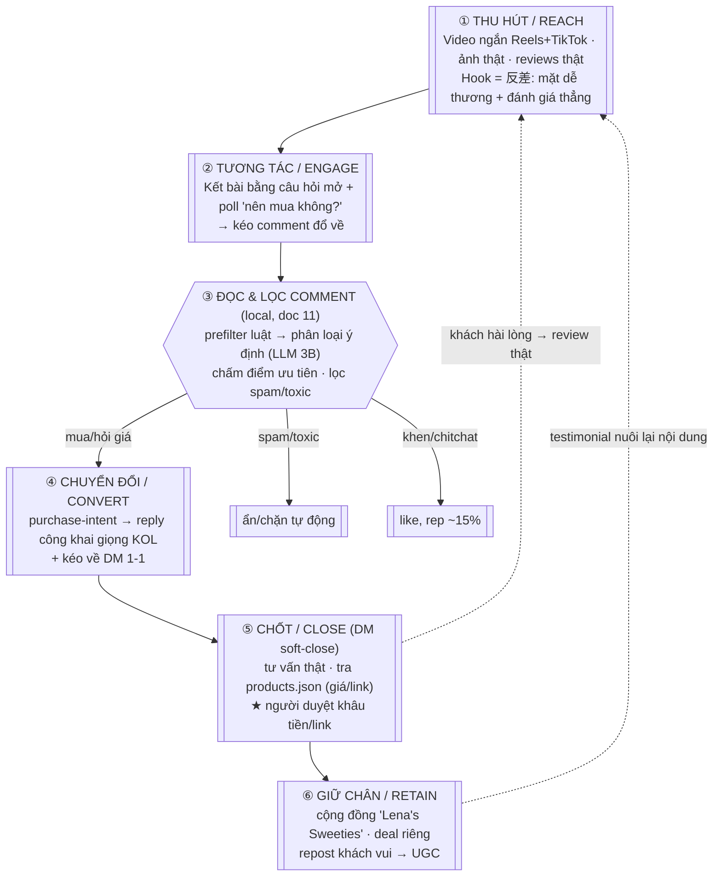

# 12 — Growth & Sales Scheme（吸引客戶總體方案）

> Master synthesis: nối 3 trụ kỹ thuật (`09` visual · `10` voice · `11` comment-loop) + persona brain
> (`03`) + Style System (`docs/04`) thành **một cỗ máy: nội dung → tương tác → khách hàng**, chạy
> local-first, cho thị trường **Đài Loan · châu Mỹ · châu Âu**.

---

## 0. Ánh xạ yêu cầu → giải pháp

| Yêu cầu của bạn | Giải pháp | Tài liệu |
|---|---|---|
| KOL trông như thật | Flux + character LoRA/PuLID + rerecipe khử "mùi AI" 4 lớp | `09` |
| Có giọng nói | IndexTTS-2 (offline ZH/EN) + CosyVoice2 (realtime) + RVC | `10` |
| Nhiều phong cách + pha trộn | Style System 2 trục Flavor × Commerce-Role + ma trận blend | `docs/04` |
| Hạn chế API, tiết kiệm | Local-first trên Mac cho Phase 1; API/cloud chỉ burst video nặng | `09/10` |
| Đọc & hành động theo comment có chọn lọc | Pipeline 5 tầng: ingest→prefilter→classify→policy→act | `11` |
| Scheme thu hút khách | Funnel dưới đây (§2) | doc này |

---

## 1. Kiến trúc tổng thể (local-first, Mac Phase 1)

```
                    ┌────────────────────────── LOCAL (Mac Apple Silicon) ──────────────────────────┐
  Persona data      │                                                                               │
  kols/lena-chen/ ──┼─► persona brain (LLM 14B qua Ollama, doc 03)                                   │
  profile.json      │        ├─ sinh caption / reply / DM theo nhân vật                              │
  products.json ────┼─►       └─ tra giá/link khi bán  ◄── comment-loop (doc 11, small LLM 3B)       │
                    │                                                                               │
  Ảnh (doc 09)  Flux+LoRA/PuLID  ── Mac: CHỈ ảnh (chậm) ─┐                                           │
  Giọng (doc 10) IndexTTS-2/CosyVoice2+RVC ──────────────┼─► ghép video talking-head ────┐          │
                    └───────────────────────────────────┘                                │          │
                    └──────────────────────────────────────────────────────────────────┼──────────┘
                                                                                         │
        VIDEO NẶNG / LIP-SYNC / TRAIN LoRA (cần CUDA) ──► BURST: NVIDIA GPU hoặc cloud thuê giờ
        REALTIME digital human / livestream ──────────► Phase 3 (LiveTalking, doc 04) — để sau
```

**Nguyên tắc tiết kiệm:** mọi thứ chạy được trên Mac thì chạy local (LLM chat/DM, comment-loop, sinh
ảnh). Chỉ 3 việc bắt buộc cần CUDA → burst NVIDIA/cloud, không duy trì chi phí liên tục:
(1) train character LoRA, (2) lip-sync/video động chất lượng cao, (3) livestream realtime (Phase 3).

---

## 2. SCHEME THU HÚT KHÁCH HÀNG — phễu 6 tầng

Đây là "scheme" chính. Đọc từ trên xuống; mũi tên hồi tiếp nuôi lại đỉnh phễu.



**Vì sao phễu này hút khách (không chỉ hút view):**
- **Trust là nhiên liệu:** KOL dám nói "cái này dở" → lời khen mới đáng tin → comment hỏi mua tăng.
- **Comment = cửa vào:** mỗi câu hỏi mở biến người xem thụ động thành lead; doc 11 lọc ra người thật sự muốn mua.
- **DM = nơi chốt:** đưa khách có ý định vào 1-1, cá nhân hoá, tra KB để báo giá/link đúng.
- **Retain = phễu tự lớn:** khách vui thành nội dung (review/UGC) kéo về đỉnh, CAC giảm dần.

---

## 3. Bảng chính sách comment (rút gọn từ doc 11)

| Ý định comment | Điểm | Hành động | Người duyệt? |
|---|---|---|---|
| Mua / "muốn mua" | 80-100 | reply giọng KOL + like + kéo DM | ✅ (khâu tiền) |
| Hỏi giá | 70-90 | reply lấy giá từ `products.json` | ✅ lần đầu |
| Hỏi hiệu quả/sản phẩm | 50-80 | reply persona (auto nếu confidence cao) | tuỳ |
| Hợp tác thương mại | — | reply "gửi email ở bio", 100% chuyển người | ✅ |
| Khen / chitchat | 30-50 | like + reply ngẫu nhiên ~15% | ❌ |
| Spam | <0 | ẩn tự động + duyệt batch | ❌ |
| Toxic ≥0.7 / quấy rối | — | ẩn/chặn, **không bao giờ tiếp lời** | ✅ block |

Mặc định **suggest mode** (AI soạn → người duyệt) rồi mới mở dần auto khi số liệu ổn.

---

## 4. Thực tế phần cứng & phân giai đoạn

| Phase | Làm gì | Chạy ở đâu | Kênh |
|---|---|---|---|
| **1 (giờ)** | Ảnh thật + video talking-head ngắn + giọng + chat/DM + đọc comment | Mac local (ảnh/LLM/comment) + burst cloud cho lip-sync/train LoRA | Reels/TikTok + DM |
| 2 | Giọng realtime, phản hồi nhanh hơn | +NVIDIA/cloud | DM/comment nhanh |
| 3 | Digital human realtime, livestream bán | NVIDIA/cloud (LiveTalking) | Live shopping |

Mac **không** train LoRA và **không** chạy lip-sync/video nặng (CUDA-only) — đây là ranh giới cứng.

---

## 5. Rào chắn tuân thủ & rủi ro (bắt buộc)

- **Ghi nhãn AI:** reply/nội dung tự động công khai cần chiến lược gắn nhãn "AI/digital creator"
  (TQ bắt buộc từ 2026/06 với AI 主播; EU AI Act yêu cầu minh bạch). Lena đã set "AI-transparent khi được hỏi".
- **ToS nền tảng (doc 11):** IG Graph API (comment/reply/hide/like — cần App Review) và YouTube Live API
  **hợp lệ**; **TikTok KHÔNG có API đọc live chat chính thức** → thư viện bên thứ ba vi phạm ToS, dễ bị
  ban → mặc định TẮT auto trên TikTok, chỉ đăng nội dung thủ công.
- **Chỉ đọc comment trên nội dung của chính KOL** (first-party), không đi cào nơi khác.
- **Người duyệt khâu tiền:** mọi hành động liên quan giá/link/DM/chặn đều qua người cho tới khi đủ tin.
- **Không dùng khuôn mặt/giọng người thật** chưa được phép; KOL là danh tính gốc 100%.

---

## 6. Next steps

1. Chọn máy render nặng: 1 laptop NVIDIA (ưu tiên) **hoặc** burst cloud theo giờ cho LoRA + lip-sync.
2. Sinh seed images cho `lena-chen` → train LoRA → điền `ai_assets.soul_id`/LoRA path.
3. Thu 1 mẫu giọng tham chiếu → tạo `voice_id` (IndexTTS-2/CosyVoice2) → điền `ai_assets.voice`.
4. Đổ catalogue thật vào `kols/lena-chen/products.json`.
5. Dựng module `interaction/` (doc 11) nối IG Graph API + LLM 3B lọc comment, chạy suggest mode.
6. Build KOL #2 (F6 溫柔, gốc Âu-Á) để phủ thị trường châu Âu.
